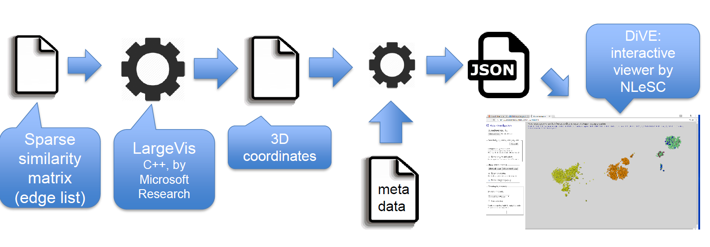

Please cite the software if you are using it in your scientific publication. 

[](https://doi.org/10.5281/zenodo.268444)

Please also cite the paper on LargeVis as stated [here](https://github.com/lferry007/LargeVis).

# Embed-Dive

Embed-Dive is a pipeline consisting of [LargeVis](https://github.com/lferry007/LargeVis) and [DiVE](http://github.com/sonjageorgievska/DiVE/). Please visit the respective repositories for more information, individual licencing etc.

The purpose of this repository is to provide a release of the pipeline to (for the moment) Linux users that want to explore their data, provided that the input is a [similarities graph](https://github.com/sonjageorgievska/Embed-Dive/blob/master/test/sim.txt). 



##Usage - for Linux users ##

Download the compiled version of Embed-Dive_linux from [here] (https://github.com/sonjageorgievska/Embed-Dive/releases) in the same folder where you have downloaded [Embed_Dive](https://github.com/sonjageorgievska/Embed-Dive). 

For quick try and test: 

    ./Embed_Dive_linux -input test/sim.txt -output test/coord.txt -outdim 3 -samples 1
 
At the end you should be able to see your browser opening the visualization. 
   
Required parameteres:
* `-input`: Input file of similarities (see the test folder for input format).
* `-output`: Output file of low-dimensional representations.

Besides the two parameters, other optional parameters include:
* `-threads`: Number of threads. Default is 8. Recommended: cores x 2.
* `-outdim`: The lower dimensionality LargesVis learns for visualization (2 or 3). Default is 2.
* `-samples`: Number of edge samples for graph layout (in millions). Default is set to ```data size / 100``` (million). 
* `-prop`: Number of times for neighbor propagations in the state of K-NNG construction, usually less than 3. Default is 3.
* `-alpha`: Initial learning rate. Default is 1.0.
* `-trees`: Number of random-projection trees used for constructing K-NNG. 50 is sufficient for most cases unless you are dealing with very large datasets (e.g. data size over 5 million), and less trees are suitable for smaller datasets. Default is set according to the data size.
* `-neg`: Number of negative samples used for negative sampling. Default is 5.
* `-neigh`: Number of neighbors (K) in K-NNG, which is usually set as three times of perplexity. Default is 150.
* `-gamma`: The weights assigned to negative edges. Default is 7.
* `-perp`: The perplexity used for deciding edge weights in K-NNG. Default is 50.
    
* `-metaData`: file containing meta information about data. Format: `[id] [metadata]`.  Format of metadata:  `"first_line" "second_line" "third_line"` (number of lines is not limited). Example line of `metadata`: `35 "A dog" "Age:2" "Color brown"`.
	
* `-dir`: base directory to store output file
* `-divedir`: directory where DiVE resides
* `-np`: A json file containing list of properties names. Ex: `["Height", "Weight", "Place of birth"]`. 
* `-json`: Name of json file which is input to DiVE. It can be uploaded at anytime later from DiVE.

Best practices: 

* Do not use the -samples parameter; let the embedding use the default value. Use -samples 1 only if you want quick results.
* Use -outdim 2 unless the visualization results are very different than with -outdim 3.
* The similarities graph does not need to contain duplicate edges (does not need to be bi-directional)
* Use the -json parameter so that you can easily load the coordinates in DiVE at any later stage. Computing the coordinates with  LargeVis takes a lot of time, it only needs to be done once.
* If you forgot to include metadata before computing coordinates, you can combine the coordinates with metadata later as described here [DiVE](http://github.com/sonjageorgievska/DiVE/) (""From output of LargeVis to input of DiVE")

Please send any suggestions for improvement to [the author](mailto:s.georgievska@esciencecenter.nl). 

## Licence ##
The software is released under the Creative Commons Attribution-NoDerivatives licence.
[Contact](mailto:s.georgievska@esciencecenter.nl) the author if you would like a version with an Apache licence 

